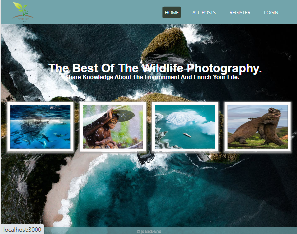
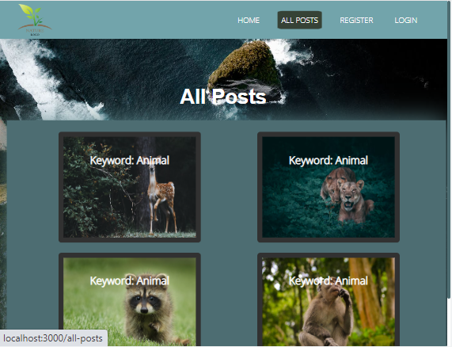
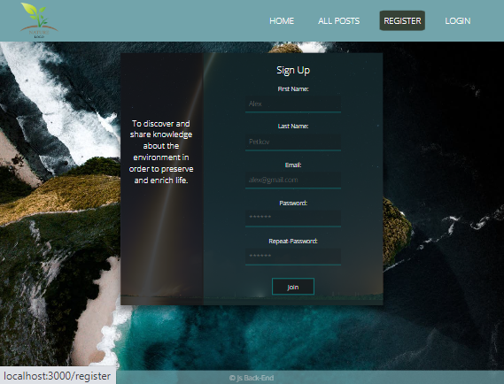

# js-backend-wildlife-photography
 Backend application built with Express.js, Handelbars and Mongoose
 
This is a backend application built with **Express.js**, **Handelbars** and **Mongoose**. It a place where users can **browse** and **upload** photos of wildlife with information regarding the photo. It was made for educational purposes only. It has **user**s, who are able to **create** posts, **edit** and **delete** them. The users that are not authenticated are only allowed to browse and see the details for a post. Logged in users can **vote** (up or down) for a post. The creator of the post cannot vote for his own post.

In order to start the project you need to run `npm install` and `npm run start`. After that you can open it on http://localhost:3000/ .

If you face any troubles or would like to discuss the code please don't hesitate to contact me. I would also appreciate any feedback :)
 
 ## Views:
 
 ###Home page
 

 ###Catalog page
 

 ###Details page (when is owner's)
 

 ###Details page (when is NOT owner's)
 

 ###Create page
 

 ###Login page
 

 ###Register page
 

 ###My-posts page
 

